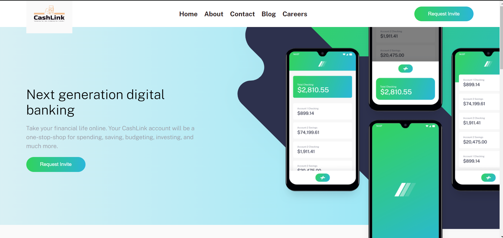

# 🌐 CashLink Landing Page Solution

Welcome to the CashLink Landing Page project! This repository contains my solution to the [CashLink landing page challenge on Frontend Mentor](https://www.frontendmentor.io/challenges/easybank-landing-page-WaUhkoDN).

## 📑 Table of Contents

- [Overview](#overview)
  - [The Challenge](#the-challenge)
  - [Screenshot](#screenshot)
  - [Links](#links)
- [My Process](#my-process)
  - [Built With](#built-with)
  - [What I Learned](#what-i-learned)
  - [Continued Development](#continued-development)
  - [Useful Resources](#useful-resources)
- [Project Structure](#project-structure)

## Overview

### The Challenge

The main objectives of this project are to:

- 🌟 Create a visually appealing and responsive landing page for CashLink.
- 🖱️ Ensure hover states for all interactive elements.
- 📱 Provide an optimal layout for different screen sizes.

### Screenshot



### Links

- 🔗 [Solution URL](https://github.com/manikkhan02/Responsive-Landing-Page/tree/main)
- 🌐 [Live Demo](https://yourusername.github.io/cashlink-landing-page/)

## My Process

### Built With

- 🖥️ Semantic HTML5
- 🎨 CSS custom properties
- 📐 Flexbox
- 🧩 CSS Grid
- 📲 Mobile-first workflow

### What I Learned

Through this project, I enhanced my understanding and skills in:

- Using CSS custom properties for theming.
- Implementing responsive design using media queries.
- Creating interactive elements with hover states.

### Continued Development

Future improvements and areas of focus:

- 🌟 Advanced CSS techniques like animations and transitions.
- ⚙️ Adding JavaScript for enhanced interactivity.
- 🚀 Optimizing performance and accessibility.

### Useful Resources

- 📚 [MDN Web Docs](https://developer.mozilla.org/)
- 💡 [CSS Tricks](https://css-tricks.com/)


## Project Structure

```markdown
.
├── index.html
├── css
│   └── styles.css
├── images
│   ├── bg-intro-desktop.svg
│   ├── bg-intro-mobile.svg
│   ├── favicon-32x32.png
│   ├── icon-api.svg
│   ├── icon-budgeting.svg
│   ├── icon-onboarding.svg
│   ├── icon-online.svg
│   └── logo.svg
└── README.md
